# UI Components — Visual Polish Plan (Material colors kept by design)

_Audited 2026-06-19 · revised 2026-06-19 after design review · diagnostic baseline: shadcn/ui_

> **Original question:** why do the `@kovojs/ui` components look like "a cheap knock-off of
> shadcn/ui"?
>
> **Design decision (this revision):** the **Material Design 3 color identity is intentional and we
> are keeping it** — teal primary, tonal neutrals, Material error red all stay. The "knock-off" feel
> is therefore **not** the palette. It is three fixable things layered on top of an otherwise
> well-built, shadcn-shaped component set:
> 1. **Color _correctness_ bugs** _within_ the Material system (a blue "warning", washed-out text, an
>    invisible skeleton, a primary button that gets _lighter_ on hover);
> 2. **Structure / anatomy gaps** vs any polished component library (missing chevron icons, an
>    unstructured select trigger, over-boxed/over-filled surfaces, outline-instead-of-ring focus);
> 3. **Native-control leaks & demo hygiene** (a raw OS checkbox, the native blue `<progress>` bar,
>    leaked debug text).
>
> shadcn is still used below as a **structural** reference (anatomy, focus model, de-boxing) — **not**
> a color target. Fixing the three buckets keeps the Material look and removes the "cheap" feel.

---

## 1. Decisions driving this revision

| Area | Decision | Effect on the old plan |
|---|---|---|
| **Accent / primary** | **Keep Material teal** (`#006a63`) on buttons, checked checkbox/radio/switch, slider, progress | Old P0 "recolor to near-black zinc-900" — **dropped** |
| **Neutrals** | **Keep the Material tint** (`#fafdfb` surfaces, `#bec9c6` borders) and current border weight; **fix only the contrast bugs** | Old "→ pure white / zinc-200" — **dropped**; keep the skeleton + washed-out-text fixes |
| **Status colors** | **Fix** success→Material green, warning→Material amber | Kept (now framed as Material-harmonized, not shadcn) |
| **Filled surfaces** | **Adopt the minimal versions** — Alert→bordered card, transparent accordion/table headers, drop heavy outer boxes | Kept |

Everything else in the original audit (focus rings, chevron icons, select trigger, OTP slots,
checkbox-group, native-control leaks, demo hygiene) is unchanged and carried into §4.

---

## 2. Root cause (diagnosis unchanged, prescription changed)

`packages/ui/src/theme.ts` binds the UI's semantic tokens (`uiTheme`) directly onto Material Design 3
system roles from `@kovojs/style` (`tokens.sys.color.*`, `tokens.sys.shape.*`), seeded from
`#0f766e` (teal-700). That binding is **what we want to keep** — it is the Material identity. The
problems are the handful of places where the mapping is _semantically wrong_ or where the component
_structure_ falls short, not the fact that it maps to Material.

Two facts from the audit are now levers rather than complaints:

- **The repo already emits the correct status hues and doesn't use them.**
  `--kovo-theme-custom-success-color: #006c4c` (a Material-harmonized green) and
  `--kovo-theme-custom-danger-color: #a73a00` (a burnt orange) exist in
  `site/src/generated/kovo-ui.css` but `uiTheme` references the custom slot **0×**. Wiring
  `success`/`warning` to these (plus a real amber) is the entire status-color fix.
- **Geometry is already right** — 6 px/12 px radii, 1 px borders, 36 px controls, Tailwind-scale
  shadows. No resizing needed; the work is color-correctness + anatomy.

_(Note for later: a parallel **shadcn-named** token sheet — `--kovo-color-*`, `--kovo-radius-*` —
exists in `packages/headless-ui/src/lib/token-sheet.ts` and is referenced 0× by the styled UI. We are
**not** switching to it; it's noted only so nobody assumes it's load-bearing.)_

---

## 3. Keep — intended Material identity (do **not** "fix")

These audit findings are **by design** under the Material decision and should be closed as
won't-fix / working-as-intended:

- **Teal primary fills** — `button` primary, `checkbox`/`radio`/`switch` checked, `slider`
  range+thumb, `progress` indicator (`accent = color.primary = #006a63`).
- **Tonal neutral surfaces & borders** — `#fafdfb` surfaces, `#bec9c6` borders keep their hue and
  weight (the faint green cast is the Material tint).
- **Material error red** for `destructive`/`danger` (`#ba1a1a`) — keep the hue (the two-tone _hover
  swap_ is addressed in §4-A as a state bug, not a hue change).
- **Badge default can be a solid _primary_ (teal) variant** — if we add a solid default badge it
  should be Material primary, not near-black.

---

## 4. Fix backlog

Ordered by leverage. **§4-A (color correctness) buys most of the "looks polished" win** because it
removes the genuinely-wrong color signals while leaving the Material palette intact.

### 4-A · Color correctness _within_ Material  ·  **P1**
- [ ] **Status colors → Material green/amber.** In `packages/ui/src/theme.ts` remap
      `success` (currently M3 `secondary`, teal) → the emitted `--kovo-theme-custom-success-color`
      green `#006c4c`; remap `warning` (currently M3 `tertiary`, **blue**) → a Material-harmonized
      amber (add one, or repurpose the `--kovo-theme-custom-danger` burnt-orange). Fixes
      `badge`, `alert`, `toast`, `meter` with no per-component edits. _(badge.tsx:45-54,
      alert.tsx:48-57.)_
- [ ] **Resting text uses the full-strength role, not muted.** Menu/breadcrumb/nav item text
      defaults to `foregroundMuted` (`onSurfaceVariant #3f4947`) and reads washed-out. Set resting
      item/link text to `foreground` (`onSurface #191c1c`); reserve muted for shortcuts/secondary
      labels. _(dropdown-menu, context-menu, menubar, navigation-menu items; breadcrumb link.)_
- [ ] **Skeleton contrast.** `skeleton` fill `backgroundSubtleHigh #e6e9e7` sits ~3 % off the
      `#fafdfb` surface and is nearly invisible. Move it to a more separated tonal step (e.g.
      `surfaceContainer`/a dedicated muted) so the block reads — keep it a Material neutral, just a
      visible one.
- [ ] **Primary/action hover should darken, not lighten.** `button` primary hover currently jumps to
      the lighter `primaryContainer` `#72f7ea` (white text on bright cyan → poor contrast); same on
      `alert-dialog` action hover. Use a Material state-layer / darker primary on hover so the control
      darkens. _(button.tsx primary `:hover`; alert-dialog action `:hover`.)_

### 4-B · Focus model  ·  **P2**
- [ ] **Replace plain outline with a ring.** Every interactive component uses
      `outline: 2px solid borderStrong; outline-offset: 2px`. Swap for a `box-shadow` ring +
      ring-offset (a `theme.shadow.focusRing` already exists in `theme.ts:50`). The ring color stays
      **Material** (e.g. primary/outline) — this is a focus-_treatment_ change, not a recolor. One
      shared edit covers the whole set.

### 4-C · Structure & anatomy  ·  **P3**
- [ ] **Icons instead of hand-drawn carets.** Replace the rotated `::after` border-square caret in
      `accordion`/`collapsible`/`disclosure` with a `ChevronDown` icon that rotates 180° on open; add
      the missing trigger chevron to `select` and `navigation-menu`; default `breadcrumb` separator to
      `ChevronRight` (not text `/`); give `command` input a leading Search glyph.
- [ ] **Select trigger layout.** `select` trigger is a bare `<button>` (value centered, no chevron).
      Make it `display:flex; justify-content:space-between; text-align:left` with the right-aligned
      chevron from above. _(select.tsx:162-193.)_
- [ ] **Alert → bordered card + icon slot.** Rebuild `alert` from a fully color-filled bar into a
      bordered card with a leading icon column (`grid-cols: auto 1fr`), title + muted description;
      use the corrected status hue on the border/icon, not as a full fill; drop the cyan `info`
      default for a neutral default. _(alert.tsx.)_
- [ ] **De-box / de-fill surfaces.** `accordion`: remove per-item border-box and the
      `[data-state=open]`/`:hover` header fill; use a single `border-bottom` + `hover:underline`.
      `table`: transparent `thead` (drop the `backgroundRaised` fill) and drop the outer
      border/radius box. `collapsible`/`disclosure`: drop the default content box; switch the
      `disclosure` trigger from the heavy `borderStrong` to the standard `border` token.
      `scroll-area`: transparent scrollbar track + drop the card border.
- [ ] **OTP contiguous slots.** `otp-field` renders four separate gapped boxes; make a single joined
      group (shared inner borders, only first/last rounded).
- [ ] **checkbox-group reuses the styled box.** It currently renders a bare native
      `<input type=checkbox>` (OS accent-color). Reuse the standalone `Checkbox`'s custom box so the
      group matches the rest of the family (still teal-checked — Material).
- [ ] **Overlay trigger borders + scrims.** Switch dialog/sheet/drawer/alert-dialog trigger borders
      from `borderStrong` to the standard `border` token (targeted weight fix, hue unchanged); raise
      `::backdrop` to `rgb(0 0 0 / 0.8)` and add the missing `::backdrop` rule to `sheet`/`drawer`;
      lower the dialog/alert-dialog panel shadow from `~shadow-2xl` (`/0.25`) to `~shadow-lg`.

### 4-D · Native-control leaks & demo hygiene  ·  **P4**
- [ ] **`progress`** — ensure the compiled interactive build fully hides the native `<progress>` so
      the OS blue bar (~`#1a73e8`) stops leaking over the teal indicator span.
- [ ] **`field`** — replace the embedded native `<select>`/checkbox with the styled components for
      consistency.
- [ ] **Gallery demos** — stop leaking `<output data-demo-state>` debug text beside widgets; restore
      overlay interactivity (cross-ref `agent/gallery-fix` + the `gallery-css-and-derive-gotchas`
      memo) so overlay panels can actually be reviewed.

---

## 5. Per-family notes (keep / fix)

Fidelity numbers below are **shadcn-fidelity (diagnostic only)** — many low scores were driven by the
Material color identity we are now keeping, so a low number ≠ "needs work." The **Fix** column is the
real backlog.

### Buttons & actions — `button` (2) · `toggle` (3) · `toggle-group` (4) · `toolbar` (3) · `kbd` (4)
**Keep:** teal primary, all geometry. **Fix:** primary hover that lightens to cyan (§4-A); unify the
three inconsistent pressed treatments (`toggle` teal / `toolbar` near-black / `toggle-group` white
card) onto one Material-consistent pressed style; ring focus.

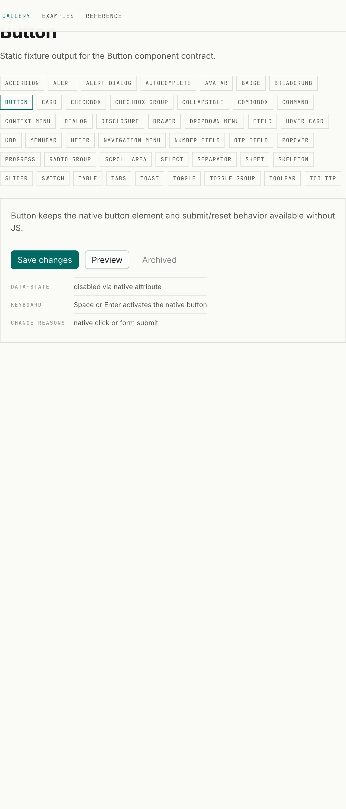

### Badges & status — `badge` (2) · `alert` (1) · `skeleton` (3) · `avatar` (3) · `separator` (4)
**Keep:** Material hues. **Fix:** `alert` → bordered card + icon (§4-C) with corrected status hue;
`badge` success teal→green / warning blue→amber (§4-A), drop the border on filled variants, bump
`fw500`→`600`, optionally add a solid teal default; `skeleton` contrast (§4-A).

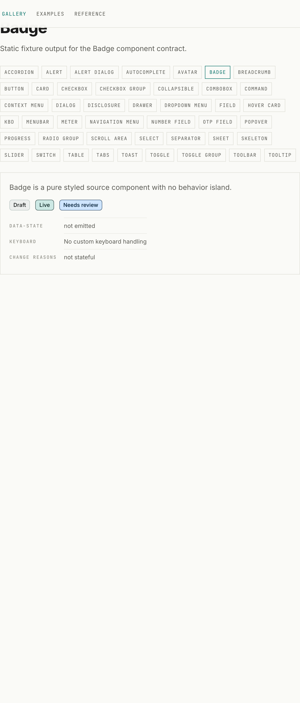
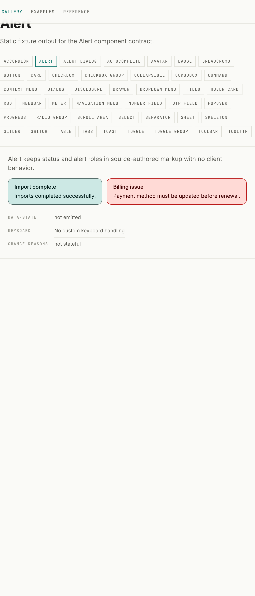

### Text & form inputs — `field` (3) · `number-field` (4) · `otp-field` (3) · `slider` (2)
**Keep:** teal slider, tonal borders. **Fix:** ring focus (§4-B); `otp` contiguous slots (§4-C);
`field` native select/checkbox → styled (§4-D); `number-field` swap `-`/`+` text for Minus/Plus
icons.

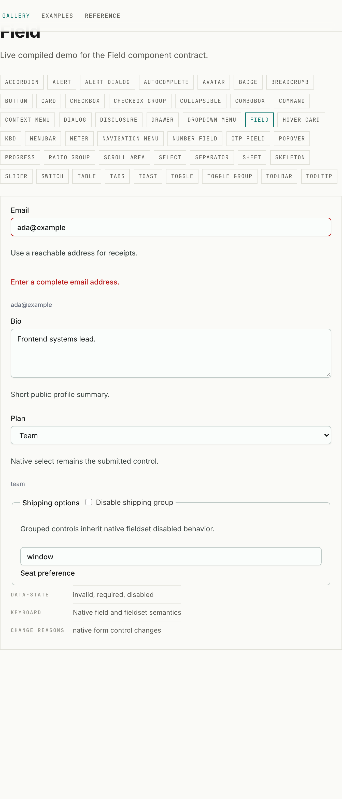
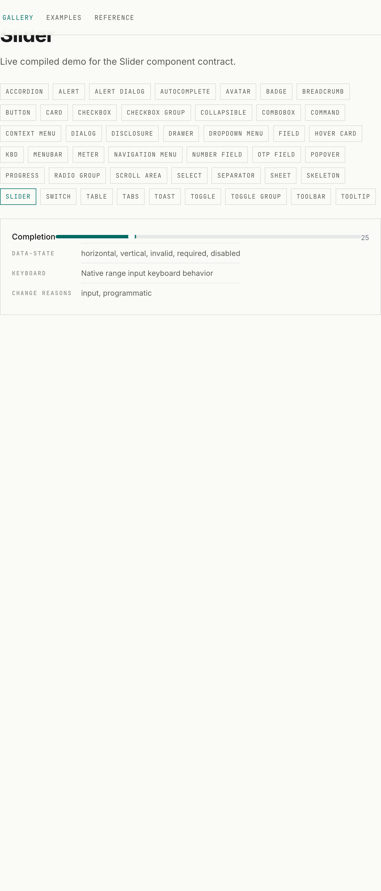

### Selection controls — `checkbox` (3) · `checkbox-group` (2) · `radio-group` (3) · `switch` (3)
**Keep:** teal checked states, geometry. **Fix:** `checkbox-group` native input → styled box (§4-C);
ring focus (§4-B).

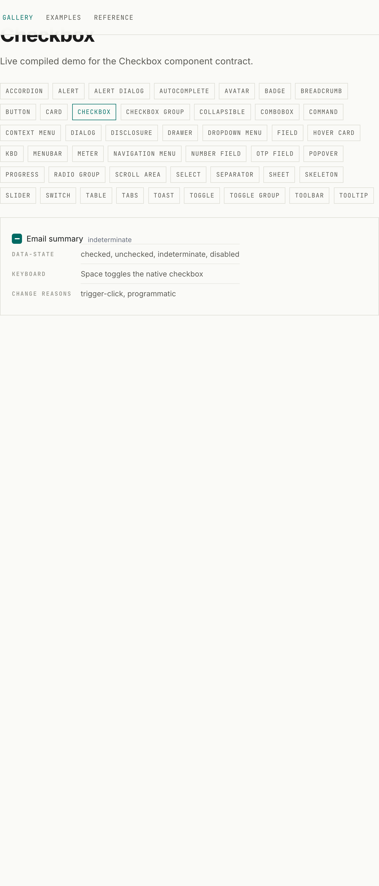
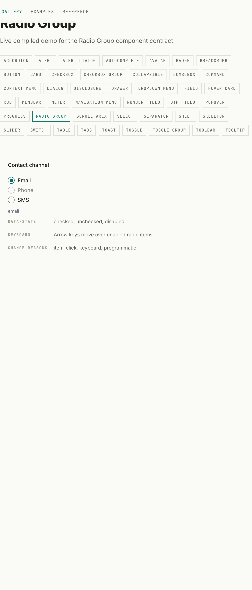
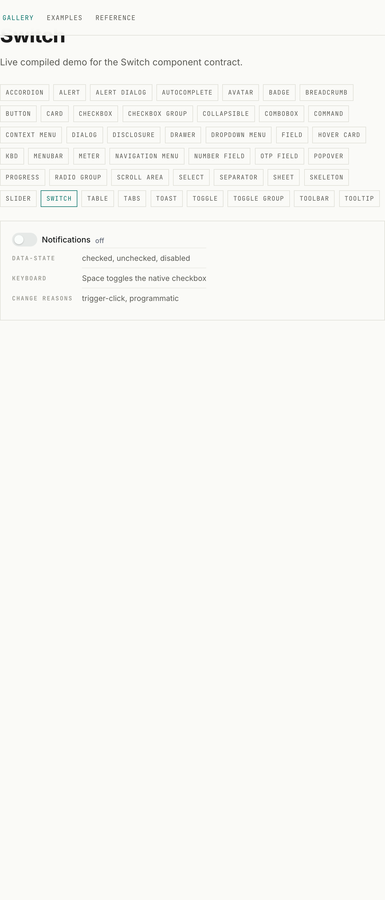

### Selects & combos — `select` (2) · `combobox` (3) · `autocomplete` (3) · `command` (2)
**Keep:** tonal surfaces. **Fix:** `select` trigger chevron + left-aligned flex layout (§4-C);
`command` leading Search glyph + unify border weights + raise dialog radius; ring focus; resting
option text → `foreground`.

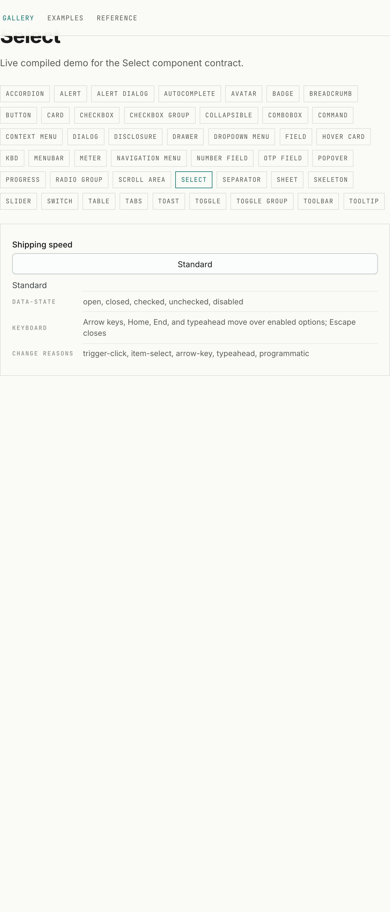

### Overlays — `dialog` (3) · `alert-dialog` (3) · `sheet` (4) · `drawer` (4) · `popover` (4) · `hover-card` (4) · `tooltip` (4)
**Keep:** tonal panels, Material hues. **Fix:** trigger borders `borderStrong`→`border`; `::backdrop`
→ 0.8 + add scrims to sheet/drawer; panel shadow → shadow-lg; `popover`/`hover-card` body text
`foregroundMuted`→`foreground`; `alert-dialog` action hover de-cyan (§4-A); ring focus. _(Panels are
frozen closed in the gallery — see §4-D — so these were read from source.)_

### Menus — `dropdown-menu` (3) · `context-menu` (3) · `menubar` (3) · `navigation-menu` (2)
**Keep:** geometry, tonal surfaces. **Fix:** resting item/trigger text `foregroundMuted`→`foreground`
(§4-A); `navigation-menu` add `ChevronDown` trigger + re-model indicator; `menubar` items
`fontWeight:500`.

### Disclosure & navigation — `accordion` (2) · `collapsible` (3) · `disclosure` (2) · `tabs` (4) · `breadcrumb` (4)
**Keep:** `tabs` (closest match already). **Fix:** `accordion`/`collapsible`/`disclosure` de-box +
transparent trigger + chevron icon (§4-C); `disclosure` trigger border `borderStrong`→`border`;
`breadcrumb` `/`→`ChevronRight`.

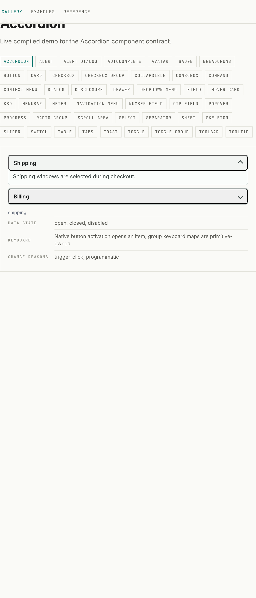
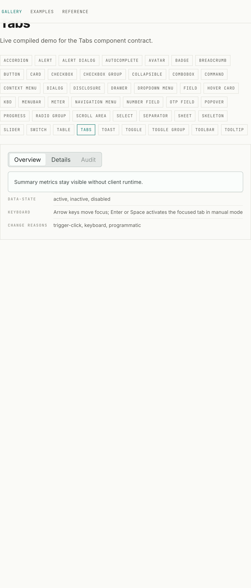

### Data & feedback — `card` (4) · `table` (3) · `progress` (2) · `meter` (2) · `toast` (3) · `scroll-area` (4)
**Keep:** teal progress, `card`. **Fix:** `table` transparent header + drop outer box (§4-C);
`meter`/`toast` status hues → green/amber (§4-A); `toast` add icon slot; `progress` native-blue leak
(§4-D); `scroll-area` transparent track + drop card border.

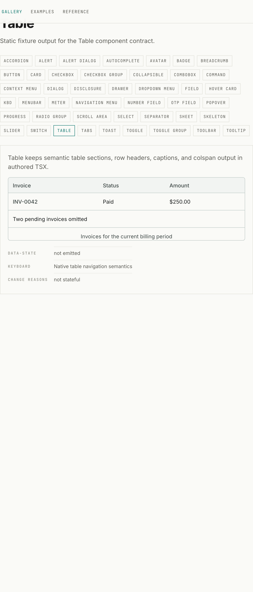

---

## 6. Caveats & scope

- **Material color is the target, not shadcn.** shadcn is referenced for _structure_ (anatomy, focus
  model, de-boxing) only. Do not recolor accents/neutrals toward zinc/near-black.
- **Light mode, teal seed (`#0f766e`).** Dark mode (`:root[data-theme="dark"]`, primary `#51dbce`)
  inherits the same mapping; the same fixes apply.
- **Overlays judged from source** — dialog/sheet/drawer/popover/menu/tooltip/toast demos are frozen
  closed on `main`; restoring interactivity (§4-D) is needed to review panels live.

## 7. How to reproduce

```bash
node site/scripts/serve-static.mjs --port 4173      # serve the built static gallery
node scratch/ui-audit/capture.mjs                   # → scratch/ui-audit/shots/*.png (44 components)
# ground truth: packages/ui/src/theme.ts + site/src/generated/kovo-ui.css (lines 101-161 resolved tokens)
```

Evidence index: per-component findings in `scratch/ui-audit/digest.txt`; raw 11-agent workflow output
in task transcript `wr2xdov3z`; screenshots in `plans/ui-components-parity-assets/`.
